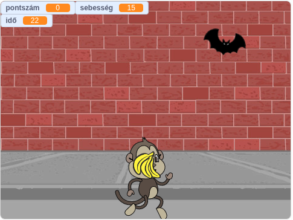
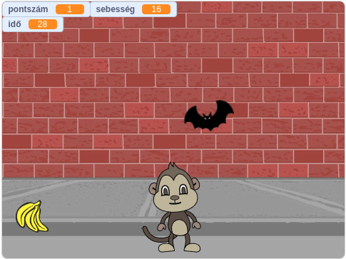
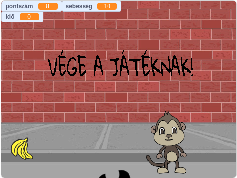

# 🐒 Dobáló Majom

Egy egyszerű játék, menyben a cél: minél több találatot elérni a cikázó denevéren, mielőtt lejár az idő!

---

## 🎮 Játékmenet
A játékban egy majmot irányítasz, akinek a képernyőn össze-vissza repkedő denevért kell eltalálnia a dobható banánnal. 

* **Időlimit:** Vigyázz, az óra ketyeg! Csak korlátozott időd van a pontgyűjtésre.
* **Pontozás:** Minden sikeres találat növeli a pontszámodat.
* **Kihívás:** A denevér mozgása kiszámíthatatlan, így jó időzítésre lesz szükséged.

## Irányítás
* **Mozgás:** A nyíl billentyűkkel 
* **Dobás:** `Space` billentyű.

## 🛠️ Technikai adatok
* **Környezet:** Scratch 3.0
* **Fájlformátum:** `.sb3`
* **Készítő:** Felföldi Máté

